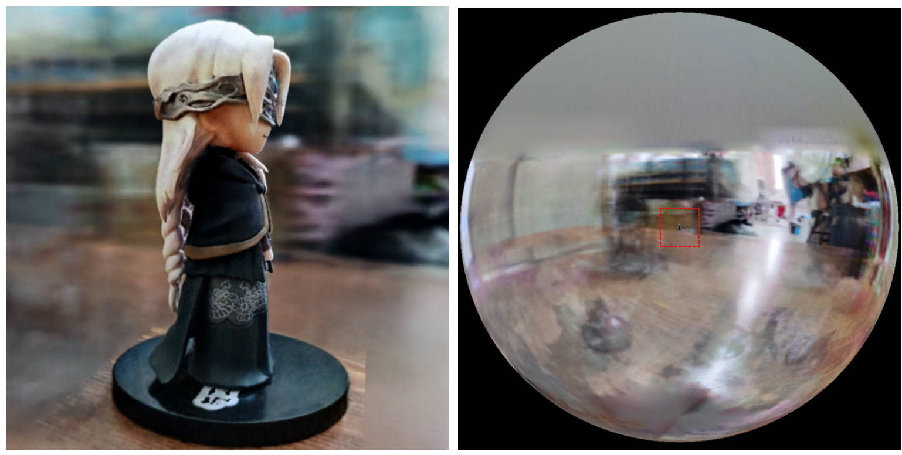

# torch-ngp

## Model description

A pytorch implementation of the NeRF part (grid encoder, density grid ray sampler) in instant-ngp, as described in Instant Neural Graphics Primitives with a Multiresolution Hash Encoding.

## Step 1: Installing

```bash
git clone --recursive http://bitbucket.iluvatar.ai:7990/scm/sol/hashnerf.git
cd hashnerf
```

### Install with pip
```bash
pip install -r requirements.txt
```

## Step 2: Training

We use the same data format as instant-ngp, e.g., [armadillo](https://github.com/NVlabs/instant-ngp/blob/master/data/sdf/armadillo.obj) and [fox](https://github.com/NVlabs/instant-ngp/tree/master/data/nerf/fox). 
Please download and put them under `./data`.

We also support self-captured dataset and converting other formats (e.g., LLFF, Tanks&Temples, Mip-NeRF 360) to the nerf-compatible format, with details in the following code block.

Supported datasets

  * [nerf_synthetic](https://drive.google.com/drive/folders/128yBriW1IG_3NJ5Rp7APSTZsJqdJdfc1) 

### One single GPU

First time running will take some time to compile the CUDA extensions.

```bash
### Instant-ngp NeRF
# train with different backbones (with slower pytorch ray marching)
# for the colmap dataset, the default dataset setting `--bound 2 --scale 0.33` is used.
python main_nerf.py data/fox --workspace trial_nerf # fp32 mode
python main_nerf.py data/fox --workspace trial_nerf --fp16 # fp16 mode (pytorch amp)
python main_nerf.py data/fox --workspace trial_nerf --fp16 --ff # fp16 mode + FFMLP (this repo's implementation)


# one for all: -O means --fp16 --cuda_ray --preload, which usually gives the best results balanced on speed & performance.
python main_nerf.py data/fox --workspace trial_nerf -O
```

```bash
# test mode
python main_nerf.py data/fox --workspace trial_nerf -O --test
```

```bash
# for the blender dataset, you should add `--bound 1.0 --scale 0.8 --dt_gamma 0`
# --bound means the scene is assumed to be inside box[-bound, bound]
# --scale adjusts the camera locaction to make sure it falls inside the above bounding box. 
# --dt_gamma controls the adaptive ray marching speed, set to 0 turns it off.
python main_nerf.py data/nerf_synthetic/lego --workspace trial_nerf -O --bound 1.0 --scale 0.8 --dt_gamma 0

# then you can train as a colmap dataset (you'll need to tune the scale & bound if necessary):
python main_nerf.py data/nerf_llff_data/fern --workspace trial_nerf -O
```

```bash
# for custom dataset, you should:
# 1. take a video / many photos from different views 
# 2. put the video under a path like ./data/custom/video.mp4 or the images under ./data/custom/images/*.jpg.
# 3. call the preprocess code: (should install ffmpeg and colmap first! refer to the file for more options)
python scripts/colmap2nerf.py --video ./data/custom/video.mp4 --run_colmap # if use video
python scripts/colmap2nerf.py --images ./data/custom/images/ --run_colmap # if use images
# 4. it should create the transform.json, and you can train with: (you'll need to try with different scale & bound & dt_gamma to make the object correctly located in the bounding box and render fluently.)
python main_nerf.py data/custom --workspace trial_nerf_custom -O --gui --scale 2.0 --bound 1.0 --dt_gamma 0.02
```

## Results on BI-V100

| Convergence criteria | Configuration (x denotes number of GPUs) | Performance | Accuracy | Power（W） | Scalability | Memory utilization（G） | Stability |
|----------------------|------------------------------------------|-------------|----------|------------|-------------|-------------------------|-----------|
| N/A                  | SDK V2.2,bs:4,1x,fp32                    | 10          | N/A      | 82         | N/A         | 28.1                    | 1         |


## Reference

**Q**: How to choose the network backbone? 

**A**: The `-O` flag which uses pytorch's native mixed precision is suitable for most cases. I don't find very significant improvement for `--tcnn` and `--ff`, and they require extra building. Also, some new features may only be available for the default `-O` mode.

**Q**: CUDA Out Of Memory for my dataset.

**A**: You could try to turn off `--preload` which loads all images in to GPU for acceleration (if use `-O`, change it to `--fp16 --cuda_ray`). Another solution is to manually set `downscale` in `NeRFDataset` to lower the image resolution.

**Q**: How to adjust `bound` and `scale`? 

**A**: You could start with a large `bound` (e.g., 16) or a small `scale` (e.g., 0.3) to make sure the object falls into the bounding box. The GUI mode can be used to interactively shrink the `bound` to find the suitable value. Uncommenting [this line](https://github.com/ashawkey/torch-ngp/blob/main/nerf/provider.py#L219) will visualize the camera poses, and some good examples can be found in [this issue](https://github.com/ashawkey/torch-ngp/issues/59).

**Q**: Noisy novel views for realistic datasets.

**A**: You could try setting `bg_radius` to a large value, e.g., 32. It trains an extra environment map to model the background in realistic photos. A larger `bound` will also help.
An example for `bg_radius` in the [firekeeper](https://drive.google.com/file/d/19C0K6_crJ5A9ftHijUmJysxmY-G4DMzq/view?usp=sharing) dataset:



## Difference from the original implementation

* Instead of assuming the scene is bounded in the unit box `[0, 1]` and centered at `(0.5, 0.5, 0.5)`, this repo assumes **the scene is bounded in box `[-bound, bound]`, and centered at `(0, 0, 0)`**. Therefore, the functionality of `aabb_scale` is replaced by `bound` here.
* For the hashgrid encoder, this repo only implements the linear interpolation mode.
* For TensoRF, we don't implement regularizations other than L1, and use `trunc_exp` as the density activation instead of `softplus`. The alpha mask pruning is replaced by the density grid sampler from instant-ngp, which shares the same logic for acceleration.


## Citation

If you find this work useful, a citation will be appreciated via:
```
@misc{torch-ngp,
    Author = {Jiaxiang Tang},
    Year = {2022},
    Note = {https://github.com/ashawkey/torch-ngp},
    Title = {Torch-ngp: a PyTorch implementation of instant-ngp}
}

@article{tang2022compressible,
    title = {Compressible-composable NeRF via Rank-residual Decomposition},
    author = {Tang, Jiaxiang and Chen, Xiaokang and Wang, Jingbo and Zeng, Gang},
    journal = {arXiv preprint arXiv:2205.14870},
    year = {2022}
}
```

## Acknowledgement

* Credits to [Thomas Müller](https://tom94.net/) for the amazing [tiny-cuda-nn](https://github.com/NVlabs/tiny-cuda-nn) and [instant-ngp](https://github.com/NVlabs/instant-ngp):
    ```
    @misc{tiny-cuda-nn,
        Author = {Thomas M\"uller},
        Year = {2021},
        Note = {https://github.com/nvlabs/tiny-cuda-nn},
        Title = {Tiny {CUDA} Neural Network Framework}
    }

    @article{mueller2022instant,
        title = {Instant Neural Graphics Primitives with a Multiresolution Hash Encoding},
        author = {Thomas M\"uller and Alex Evans and Christoph Schied and Alexander Keller},
        journal = {arXiv:2201.05989},
        year = {2022},
        month = jan
    }
    ```

* The framework of NeRF is adapted from [nerf_pl](https://github.com/kwea123/nerf_pl):
    ```
    @misc{queianchen_nerf,
        author = {Quei-An, Chen},
        title = {Nerf_pl: a pytorch-lightning implementation of NeRF},
        url = {https://github.com/kwea123/nerf_pl/},
        year = {2020},
    }
    ```

* The official TensoRF [implementation](https://github.com/apchenstu/TensoRF):
    ```
    @article{TensoRF,
      title={TensoRF: Tensorial Radiance Fields},
      author={Chen, Anpei and Xu, Zexiang and Geiger, Andreas and Yu, Jingyi and Su, Hao},
      journal={arXiv preprint arXiv:2203.09517},
      year={2022}
    }
    ```

* The NeRF GUI is developed with [DearPyGui](https://github.com/hoffstadt/DearPyGui).
