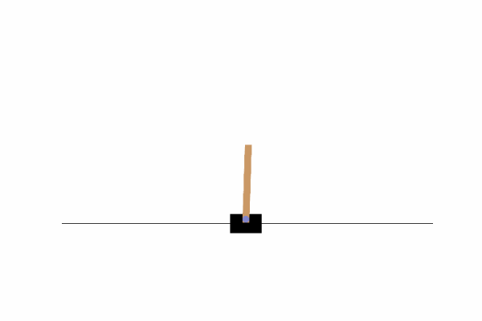

# DQN

## Model description
The classic DQN algorithm in reinforcement learning is a value-based rather than a policy-based method. DQN does not learn a policy, but a critic. Critic does not directly take action, but evaluates the quality of the action.

+ Paper: DQN in [Human-level Control Through Deep Reinforcement Learning](http://www.nature.com/nature/journal/v518/n7540/full/nature14236.html)

## Step 1: Installation

```bash
git clone  https://github.com/PaddlePaddle/PARL.git
cd PARL/examples/DQN
pip3 install -r requirements.txt
pip3 install matplotlib
pip3 install urllib3==1.26.6
```


## Step 2: Training

```bash
# 1 GPU
python3 train.py
```
## Step 3: Evaluating

```bash
mv ../../../evaluate.py ./
python3 evaluate.py
```
## Result

Performance of DQN playing CartPole-v0
<p align="left">

</p>

|GPUs|Reward|
|:---:|:---:|
|BI-V100|200.0|

## Reference
- [PARL](https://github.com/PaddlePaddle/PARL)