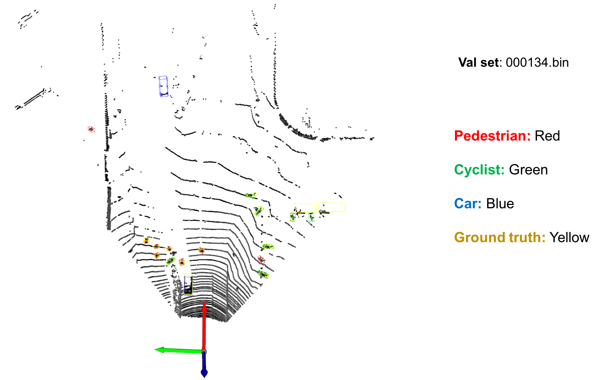
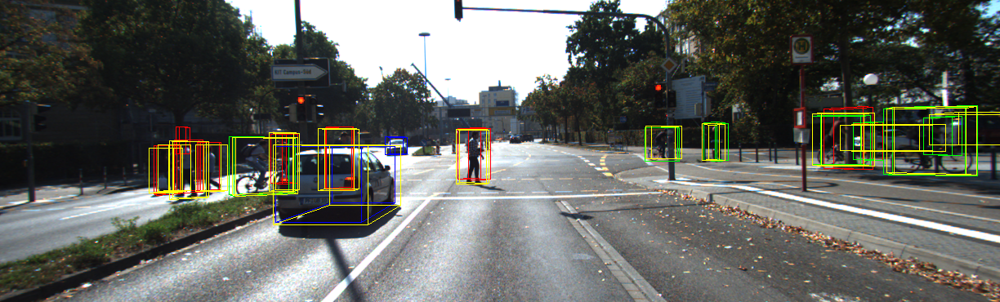

# [PointPillars: Fast Encoders for Object Detection from Point Clouds](https://arxiv.org/abs/1812.05784) 

A Simple PointPillars PyTorch Implenmentation for 3D Lidar(KITTI) Detection.

- It can be run without installing [mmcv](https://github.com/open-mmlab/mmcv), [Spconv](https://github.com/traveller59/spconv), [mmdet](https://github.com/open-mmlab/mmdetection) or [mmdet3d](https://github.com/open-mmlab/mmdetection3d). 
- Only one detection network (PointPillars) was implemented in this repo, so the code may be more easy to read. 
- Sincere thanks for the great open-souce architectures [mmcv](https://github.com/open-mmlab/mmcv), [mmdet](https://github.com/open-mmlab/mmdetection) and [mmdet3d](https://github.com/open-mmlab/mmdetection3d), which helps me to learn 3D detetion and implement this repo.

## Detection Visualization




## [Compile] 

```
cd ops
python3 setup.py develop
```

## [Datasets]

1. Download

    Download [point cloud](https://s3.eu-central-1.amazonaws.com/avg-kitti/data_object_velodyne.zip)(29GB), [images](https://s3.eu-central-1.amazonaws.com/avg-kitti/data_object_image_2.zip)(12 GB), [calibration files](https://s3.eu-central-1.amazonaws.com/avg-kitti/data_object_calib.zip)(16 MB)和[labels](https://s3.eu-central-1.amazonaws.com/avg-kitti/data_object_label_2.zip)(5 MB)。
    Or you can download from fileserve,
    ```
    wget http://10.150.9.95/swapp/datasets/cv/3d_detection/kitti.tar.gz
    tar -xzvf kitti.tar.gz
    ```
    Format the datasets as follows:
    ```
    kitti
        |- training
            |- calib (#7481 .txt)
            |- image_2 (#7481 .png)
            |- label_2 (#7481 .txt)
            |- velodyne (#7481 .bin)
        |- testing
            |- calib (#7518 .txt)
            |- image_2 (#7518 .png)
            |- velodyne (#7418 .bin)
    ```

2. Pre-process KITTI datasets First

    ```
    cd PointPillars/
    python pre_process_kitti.py --data_root your_path_to_kitti
    ```

    Now, we have datasets as follows:
    ```
    kitti
        |- training
            |- calib (#7481 .txt)
            |- image_2 (#7481 .png)
            |- label_2 (#7481 .txt)
            |- velodyne (#7481 .bin)
            |- velodyne_reduced (#7481 .bin)
        |- testing
            |- calib (#7518 .txt)
            |- image_2 (#7518 .png)
            |- velodyne (#7518 .bin)
            |- velodyne_reduced (#7518 .bin)
        |- kitti_gt_database (# 19700 .bin)
        |- kitti_infos_train.pkl
        |- kitti_infos_val.pkl
        |- kitti_infos_trainval.pkl
        |- kitti_infos_test.pkl
        |- kitti_dbinfos_train.pkl
    
    ```

## [Training]

### Single GPU training
```
cd PointPillars/
python3 train.py --data_root your_path_to_kitti
```
### Multiple GPU training
```
python3 -m torch.distributed.launch --nproc_per_node 8 train_dist.py --data_root your_path_to_kitti
```
## [Evaluation]

```
cd PointPillars/
python3 evaluate.py --ckpt pretrained/epoch_160.pth --data_root your_path_to_kitti 
```

## [Test]

```
cd PointPillars/

# 1. infer and visualize point cloud detection
python3 test.py --ckpt pretrained/epoch_160.pth --pc_path your_pc_path 

# 2. infer and visualize point cloud detection and gound truth.
python3 test.py --ckpt pretrained/epoch_160.pth --pc_path your_pc_path --calib_path your_calib_path  --gt_path your_gt_path

# 3. infer and visualize point cloud & image detection
python3 test.py --ckpt pretrained/epoch_160.pth --pc_path your_pc_path --calib_path your_calib_path --img_path your_img_path


e.g. [infer on val set 000134]

python3 test.py --ckpt pretrained/epoch_160.pth --pc_path /home/lifa/data/KITTI/training/velodyne_reduced/000134.bin

or

python3 test.py --ckpt pretrained/epoch_160.pth --pc_path data/kitti/training/velodyne_reduced/000134.bin --calib_path data/kitti/training/calib/000134.txt --img_path data/kitti/training/image_2/000134.png --gt_path data/kitti/training/label_2/000134.txt

```

## Acknowledements

Thanks for the open souce code [mmcv](https://github.com/open-mmlab/mmcv), [mmdet](https://github.com/open-mmlab/mmdetection) and [mmdet3d](https://github.com/open-mmlab/mmdetection3d).
