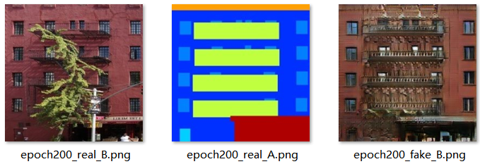

# Pix2pix
## Model description
Pix2pix uses paired images for image translation, which has two different styles of the same image as input, can be used for style transfer. Pix2pix is encouraged by cGAN, cGAN inputs a noisy image and a condition as the supervision information to the generation network, Pix2pix uses another style of image as the supervision information input into the generation network, so the fake image is related to another style of image which is input as supervision information, thus realizing the process of image translation.

## Step 1: Installation
```bash
git clone https://github.com/PaddlePaddle/PaddleGAN.git
```

```bash
cd PaddleGAN
pip3 install -r requirements.txt
pip3 install urllib3==1.26.6
yum install mesa-libGL -y
```

## Step 2: Preparing datasets

Datasets used by Pix2pix can be downloaded from [here](http://efrosgans.eecs.berkeley.edu/pix2pix/datasets/).

```bash
wget http://efrosgans.eecs.berkeley.edu/pix2pix/datasets/facades.tar.gz --no-check-certificate
```

For example, the path structure of facades is as following:

```bash
facades
    ├── test
    ├── train
    └── val
```

## Step 3: Training

```bash
# move facades dataset to data/ 
tar -xzvf facades.tar.gz
mv facades/ data/
# 1 GPU
python3 -u tools/main.py --config-file configs/pix2pix_facades.yaml
```

## Step 4: Evaluation

```bash
python3 tools/main.py --config-file configs/pix2pix_facades.yaml --evaluate-only --load ${PATH_OF_WEIGHT}
```

## Results
|GPUs|Metric FID|FPS|
|:---:|:---:|:---:|
|BI-V100|120.5818|16.12240|

The generated images at epoch 200 is shown below:




## Reference
- [PaddleGAN](https://github.com/PaddlePaddle/PaddleGAN) 
