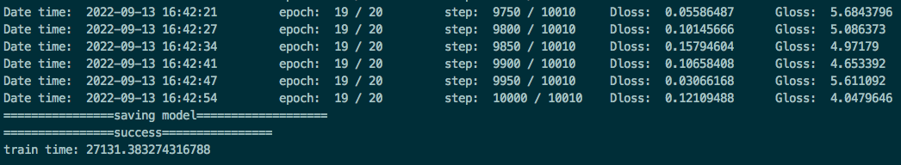
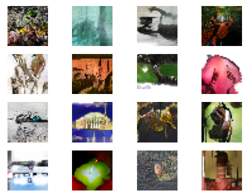
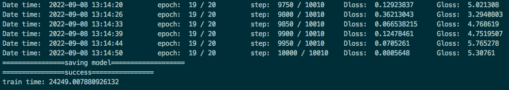
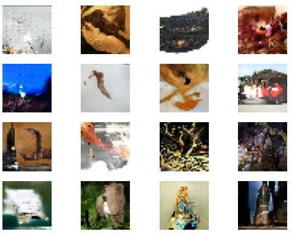

# DCGAN
## Model description

The deep convolutional generative adversarial networks (DCGANs) first introduced CNN into the GAN structure, and the strong feature extraction ability of convolution layer was used to improve the generation effect of GAN.

[Paper](https://arxiv.org/pdf/1511.06434.pdf): Radford A, Metz L, Chintala S. Unsupervised Representation Learning with Deep Convolutional Generative Adversarial Networks[J]. Computer ence, 2015.
## Step 1: Installing
```
pip3 install -r requirements.txt
```
## Step 2: Prepare Datasets

Train DCGAN Dataset used: [Imagenet-1k](<http://www.image-net.org/index>)

- Dataset size: ~125G, 224*224 colorful images in 1000 classes
    - Train: 120G, 1281167 images
    - Test: 5G, 50000 images
- Data format: RGB images.
    - Note: Data will be processed in src/dataset.py

```path

└─imagenet_original
  └─train
```
## Step 3: Training
### On single GPU 
```bash
python3 train.py --device_id=2 --data_url=/home/datasets/cv/imagenet/train --train_url=./ --device_target=GPU
```
### Multiple GPUs on one machine
```
bash scripts/run_distribute_train_gpu.sh 8 "0,1,2,3,4,5,6,7" /home/datasets/cv/imagenet/train ./
```

### [Evaluation]

```bash
python3 -u eval.py --device_id=$DEVICE_ID --img_url=$PATH1 --ckpt_url=$PATH2 --device_target=GPU
```

### [Evaluation result]
### 单卡性能数据：BI


### 单卡性能数据：NV 




