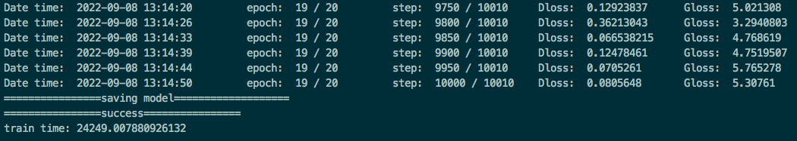

# DCGAN

## Model description

The deep convolutional generative adversarial networks (DCGANs) first introduced CNN into the GAN structure, and the strong feature extraction ability of convolution layer was used to improve the generation effect of GAN.

[Paper](https://arxiv.org/pdf/1511.06434.pdf): Radford A, Metz L, Chintala S. Unsupervised Representation Learning with Deep Convolutional Generative Adversarial Networks[J]. Computer ence, 2015.
## Step 1: Installing
```
pip3 install -r requirements.txt
```
## Step 2: Prepare Datasets

Train DCGAN Dataset used: [Imagenet-1k](http://www.image-net.org/index)

- Dataset size: ~125G, 224*224 colorful images in 1000 classes
    - Train: 120G, 1281167 images
    - Test: 5G, 50000 images
- Data format: RGB images.
    - Note: Data will be processed in src/dataset.py

Sign up and login in [ImageNet official website](https://www.image-net.org/index.php), then choose 'Download' to download the whole ImageNet dataset. Specify `/path/to/imagenet` to your ImageNet path in later training process.

The ImageNet dataset path structure should look like:

```bash
imagenet
├── train
│   └── n01440764
│       ├── n01440764_10026.JPEG
│       └── ...
├── train_list.txt
├── val
│   └── n01440764
│       ├── ILSVRC2012_val_00000293.JPEG
│       └── ...
└── val_list.txt
```

## Step 3: Training
### On single GPU 
```bash
python3 train.py --device_id=2 --data_url=/path/to/imagenet/train --train_url=./ --device_target=GPU
```
### [Evaluation]

```bash
python3 -u eval.py --device_id=$DEVICE_ID --img_url=$PATH1 --ckpt_url=$PATH2 --device_target=GPU
```

### [Evaluation result]
### 单卡性能数据：BI-V100


### 单卡性能数据：NV-V100S 



