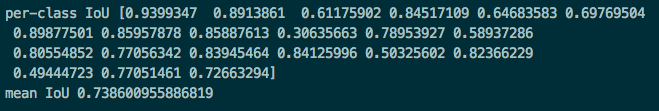
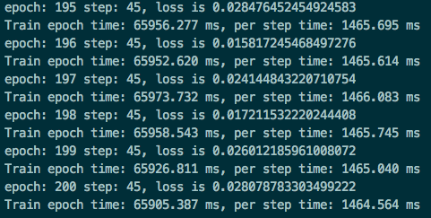
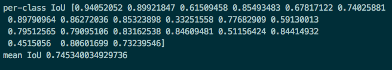
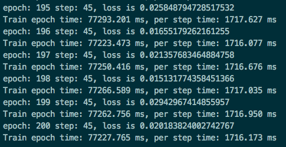

# DeepLabV3
## Model description
DeepLab is a series of image semantic segmentation models, DeepLabV3 improves significantly over previous versions. Two keypoints of DeepLabV3: Its multi-grid atrous convolution makes it better to deal with segmenting objects at multiple scales, and augmented ASPP makes image-level features available to capture long range information.
This repository provides a script and recipe to DeepLabV3 model and achieve state-of-the-art performance.

Refer to [this paper][1] for network details.
`Chen L C, Papandreou G, Schroff F, et al. Rethinking atrous convolution for semantic image segmentation[J]. arXiv preprint arXiv:1706.05587, 2017.`

[1]: https://arxiv.org/abs/1706.05587
## Step 1: Installing
```
pip3 install -r requirements.txt
```
## Step 2: Prepare Datasets
Pascal VOC datasets and Semantic Boundaries Dataset

- Download segmentation dataset.

- Prepare the training data list file. The list file saves the relative path to image and annotation pairs. Lines are like:

```shell
JPEGImages/00001.jpg SegmentationClassGray/00001.png
JPEGImages/00002.jpg SegmentationClassGray/00002.png
JPEGImages/00003.jpg SegmentationClassGray/00003.png
JPEGImages/00004.jpg SegmentationClassGray/00004.png
......
```

You can also generate the list file automatically by run script: `python get_dataset_lst.py --data_root=/PATH/TO/DATA`

- Configure and run build_data.sh to convert dataset to mindrecords. Arguments in scripts/build_data.sh:

 ```shell
 --data_root                 root path of training data
 --data_lst                  list of training data(prepared above)
 --dst_path                  where mindrecords are saved
 --num_shards                number of shards of the mindrecords
 --shuffle                   shuffle or not
 ```
# [Pretrained models](#contents)
Please [resnet101](https://download.mindspore.cn/model_zoo/r1.2/resnet101_ascend_v120_imagenet2012_official_cv_bs32_acc78/) download resnet101 here

## Step 3: Training
```
python3 train.py --data_file=/home/dataset/deeplabv3/vocaug_train.mindrecord0 --train_dir=./ckpt --train_epochs=200 --batch_size=32 --crop_size=513 --base_lr=0.015 --lr_type=cos --min_scale=0.5 --max_scale=2.0 --ignore_label=255 --num_classes=21 --model=deeplab_v3_s16 --ckpt_pre_trained=./resnet101_ascend_v120_imagenet2012_official_cv_bs32_acc78.ckpt --save_steps=1500 --keep_checkpoint_max=200 --device_target=GPU
```
### [Evaluation]
```
python3 eval.py --data_root=deeplabv3/ --data_lst=voc_val_lst.txt --batch_size=32 --crop_size=513 --ignore_label=255 --num_classes=21 --model=deeplab_v3_s16 --scales_type=0 --freeze_bn=True --device_target=GPU --ckpt_path=deeplab_v3_s16-200_45.ckpt
```
### [Evaluation result]
### 性能数据：BI


### 性能数据：NV 



