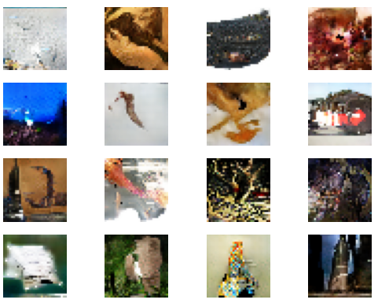

# DCGAN

## Model Description

The deep convolutional generative adversarial networks (DCGANs) first introduced CNN into the GAN structure, and the
strong feature extraction ability of convolution layer was used to improve the generation effect of GAN.

## Supported Environments

| GPU    | [IXUCA SDK](https://gitee.com/deep-spark/deepspark#%E5%A4%A9%E6%95%B0%E6%99%BA%E7%AE%97%E8%BD%AF%E4%BB%B6%E6%A0%88-ixuca) | Release |
| :----: | :----: | :----: |
| BI-V100 | 3.0.0     |  23.03  |

## Model Preparation

### Prepare Resources

Train DCGAN Dataset used: [Imagenet-1k](http://www.image-net.org/index)

- Dataset size: ~125G, 224*224 colorful images in 1000 classes
  - Train: 120G, 1281167 images
  - Test: 5G, 50000 images
- Data format: RGB images.
  - Note: Data will be processed in src/dataset.py

Sign up and login in [ImageNet official website](https://www.image-net.org/index.php), then choose 'Download' to
download the whole ImageNet dataset. Specify `/path/to/imagenet` to your ImageNet path in later training process.

The ImageNet dataset path structure should look like:

```bash
imagenet
├── train
│   └── n01440764
│       ├── n01440764_10026.JPEG
│       └── ...
├── train_list.txt
├── val
│   └── n01440764
│       ├── ILSVRC2012_val_00000293.JPEG
│       └── ...
└── val_list.txt
```

### Install Dependencies

```bash
pip3 install -r requirements.txt
```

## Model Training

```bash
# On single GPU
python3 train.py --device_id=2 --data_url=/path/to/imagenet/train --train_url=./ --device_target=GPU

# Evaluation
python3 -u eval.py --device_id=$DEVICE_ID --img_url=$PATH1 --ckpt_url=$PATH2 --device_target=GPU
```

## Model Results

One BI-V100 GPU


One NV-V100S GPU




## References

- [Paper](https://arxiv.org/pdf/1511.06434.pdf)
