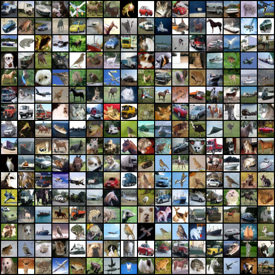

# DDPM (Denoising Diffusion Probabilistic Models)

## Model description

Unofficial PyTorch implementation of Denoising Diffusion Probabilistic Models. This implementation follows the most of details in official TensorFlow implementation. 

## Step 1: Installation


```bash
pip3 install -U pip setuptools
pip3 install -r requirements.txt
pip3 install protobuf==3.20.3
yum install -y mesa-libGL 
pip3 install urllib3==1.26.6

```


## Step 2: Preparing datasets


```bash
mkdir -p stats && cd stats
```

Download precalculated statistic for dataset:

[cifar10.train.npz](https://drive.google.com/drive/folders/1UBdzl6GtNMwNQ5U-4ESlIer43tNjiGJC)

the dataset structure sholud look like:

```
stats
└── cifar10.train.npz
```

## Step 3: Training


```bash
cd ..

# 8 GPUs
export CUDA_VISIBLE_DEVICES=0,1,2,3,4,5,6,7

python3 main.py --train \
    --flagfile ./config/CIFAR10.txt \
    --parallel

# 1 GPU
export CUDA_VISIBLE_DEVICES=0

python3 main.py --train \
    --flagfile ./config/CIFAR10.txt
```

## Step 4: Evaluate

```
# 8 GPUs
export CUDA_VISIBLE_DEVICES=0,1,2,3,4,5,6,7

python3 main.py \
    --flagfile ./logs/DDPM_CIFAR10_EPS/flagfile.txt \
    --notrain \
    --eval \
    --parallel

# 1 GPU
export CUDA_VISIBLE_DEVICES=0

python3 main.py \
    --flagfile ./logs/DDPM_CIFAR10_EPS/flagfile.txt \
    --notrain \
    --eval
```


## Results

| GPUs | FPS  |
| ------ | -------- |
| BI-V100 x8 | 1.65 it/s |



## Reference
- [DDPM](https://github.com/w86763777/pytorch-ddpm/tree/master)
