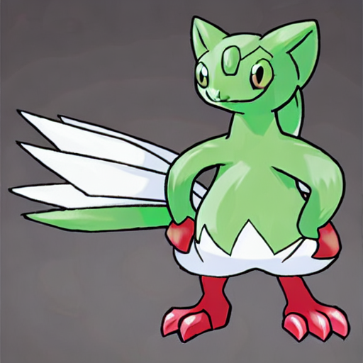

# Stable Diffusion

## Model description
Stable Diffusion is a text-to-image latent diffusion model created by the researchers and engineers from CompVis, Stability AI, LAION and RunwayML. It's trained on 512x512 images from a subset of the LAION-5B database. This model uses a frozen CLIP ViT-L/14 text encoder to condition the model on text prompts. With its 860M UNet and 123M text encoder, the model is relatively lightweight and runs on a GPU with at least 4GB VRAM. See the model card for more information.

## Prepare

### Install zlib-1.2.9

```bash
wget http://www.zlib.net/fossils/zlib-1.2.9.tar.gz
tar xvf zlib-1.2.9.tar.gz
cd zlib-1.2.9/
./configure && make install
cd ..
rm -rf zlib-1.2.9.tar.gz zlib-1.2.9/
```

### Install openmpi

```bash
yum install -y openmpi3-devel
export LD_LIBRARY_PATH=$LD_LIBRARY_PATH:/usr/lib64/openmpi3/lib/
```

### Install requirements

```bash
pip3 install -r requirements.txt
```

## Train

### Step 1 使用accelerate初始化训练环境

```bash
accelerate config  # 这里可以选择单卡或者多卡训练
                   # 这里建议只选择多卡或者单卡，其他优化选项例如：torch dynamo，deepspeed等均不建议使用
```

**Single GPU example**


**Multi GPU example**


### Step 2 开始训练

```bash
export MODEL_NAME="CompVis/stable-diffusion-v1-4"
export dataset_name="lambdalabs/pokemon-blip-captions"

accelerate launch --mixed_precision="fp16"  train_text_to_image.py \
  --pretrained_model_name_or_path=$MODEL_NAME \
  --dataset_name=$dataset_name \
  --use_ema \
  --resolution=512 --center_crop --random_flip \
  --train_batch_size=1 \
  --gradient_accumulation_steps=4 \
  --gradient_checkpointing \
  --max_train_steps=15000 \
  --learning_rate=1e-05 \
  --max_grad_norm=1 \
  --lr_scheduler="constant" --lr_warmup_steps=0 \
  --output_dir="sd-pokemon-model"
```

## Test

```bash
## 可以在test.py中修改prompt
python3 test.py
```

## Example

prompt: A pokemon with green eyes and red legs

result:

