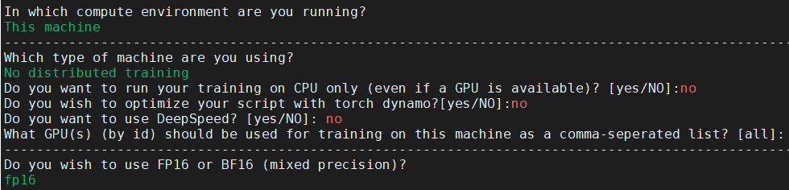

# Stable Diffusion 1.4

## Model Description

Stable Diffusion 1.4 is a cutting-edge text-to-image generative model that transforms textual descriptions into
high-quality visual representations. Built on latent diffusion architecture, it efficiently generates 512x512 pixel
images by operating in a compressed latent space. The model leverages a frozen CLIP ViT-L/14 text encoder to interpret
and process input prompts. With its 860M UNet and 123M text encoder, Stable Diffusion achieves remarkable results while
maintaining computational efficiency, making it accessible for users with GPUs having at least 4GB VRAM.

## Supported Environments

| GPU    | [IXUCA SDK](https://gitee.com/deep-spark/deepspark#%E5%A4%A9%E6%95%B0%E6%99%BA%E7%AE%97%E8%BD%AF%E4%BB%B6%E6%A0%88-ixuca) | Release |
|--------|-----------|---------|
| BI-V100 | 3.0.0     |  23.03  |

## Model Preparation

### Install Dependencies

```bash
# Install zlib-1.2.9
wget http://www.zlib.net/fossils/zlib-1.2.9.tar.gz
tar xvf zlib-1.2.9.tar.gz
cd zlib-1.2.9/
./configure && make install
cd ..
rm -rf zlib-1.2.9.tar.gz zlib-1.2.9/

# Install openmpi
yum install -y openmpi3-devel
export LD_LIBRARY_PATH=$LD_LIBRARY_PATH:/usr/lib64/openmpi3/lib/

# Install requirements
pip3 install -r requirements.txt
```

## Model Training

Use accelerate to initial the traing environment.

```bash
# 这里可以选择单卡或者多卡训练
# 这里建议只选择多卡或者单卡，其他优化选项例如：torch dynamo，deepspeed等均不建议使用
accelerate config 
```

Single GPU example.



Multi GPU example.


if you want to train with "fp32"(mixed precision),you can choose "no"

Start Training.

```bash
export MODEL_NAME="CompVis/stable-diffusion-v1-4"
export dataset_name="lambdalabs/pokemon-blip-captions"

accelerate launch train_text_to_image.py \
  --pretrained_model_name_or_path=$MODEL_NAME \
  --dataset_name=$dataset_name \
  --use_ema \
  --resolution=512 --center_crop --random_flip \
  --train_batch_size=1 \
  --gradient_accumulation_steps=4 \
  --gradient_checkpointing \
  --max_train_steps=15000 \
  --learning_rate=1e-05 \
  --max_grad_norm=1 \
  --lr_scheduler="constant" --lr_warmup_steps=0 \
  --output_dir="sd-pokemon-model"
```

Start Testing.

```bash
# 可以在test.py中修改prompt
## example prompt: A pokemon with green eyes and red legs
python3 test.py
```

## Model Results


